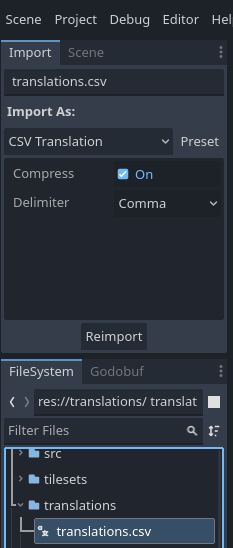

# Fiubakka Game
Trabajo profesional: Juego distribuido en Akka (Client)

## Dependencies

* [godot](https://godotengine.org/download/archive/4.1.3-stable/)

## How to run the client

First, the godot executable needs to be added to $PATH. To do that you can run the following commands (/usr/bin is just an example. You can use any folder present in $PATH)

  ```console
> sudo cp Godot_v4.1.3-stable_linux.x86_64 /usr/bin
> sudo mv Godot_v4.1.3-stable_linux.x86_64 godot
```

After cloning the repository, the protobuf submodule needs to be updated using the command:
`git submodule update --recursive --remote`

That brings all the .proto files from another repository, but before using them they need to be compiled by running the following command: `./godbuf-compile.sh`

Once the server is running, you can start the client by running the command `godot` on the root directory. If you want to open the godot ide, you can add the `-e` parameter.

## Exporting the project

### Windows / Linux

To export the project as an executable file (either a Windows `.exe` file or a Linux executable binary), you will first need to download the required Export Template. 
From the `Editor` menu, go to `Manage Export Templates`, select `Official GitHub Releases mirror` from the `Download from` dropdown and click `Download and Install`.


After the Export Template installation is finished, close the Export Template Manager and open the Export menu from `Project` > `Export`. From the Export menu, click Add and select your target platform. In this example we will choose `Windows Desktop`, but this guide works for `Linux/X11` as well.


This will create a new preset using the previously installed Export Template. 
Under the `Options` tab, in the `Application` section, you can complete project information such as the version, company name, game name, etc.
Next, check that the `Embed PCK` option is checked, under the `Binary Format` section.


Finally, choose a destination directory (for example `/exported`), name your executable file and click `Save` to export the project. 


**Note** the `Export with Debug` checkbox. When checked, the project will be exported with an output console which helps with debugging. In most cases, it should be unchecked


## Localization

Localized text is kept in `translations/translations.csv`. It has the following structure:


|keys|<lang_1>|<lang_2>|...|
| --- | --- | --- | --- |
|GREETING|Hello!|Hola!|...|
|GAME_OVER|Game over|Fin del juego|...|

Where the column `keys` contains the label tag of the localized text and the `lang_x` columns contain the 
corresponding translations for every defined language. For example, `lang_1` could be `en` (English) and `lang_2` could be `es` (Spanish). The locale column name has to be one of the [supported locale codes](https://docs.godotengine.org/en/stable/tutorials/i18n/locales.html)

To avoid errors when using commas, line breaks, double quotes or other special characters, remember to wrap a translation in quotes `"`.

When you add, remove or modify a translation, you need to import (or re-import) the translation file from the editor, under the Import tab:



Once imported, Godot will generate new `.translation` files for every defined locale in the `csv` files. You will then need to add them from the `Localization` settings:


Lastly, configure your testing locale from the project settings to the locale you wish to test:


In short, everytime you add or modify a translation you have to:
- edit `translations.csv`
- re-import the translations csv file from the editor

For more details on locales in Godot:
- [Importing translations](https://docs.godotengine.org/en/stable/tutorials/assets_pipeline/importing_translations.html)
- [Internationalizing games](https://docs.godotengine.org/en/stable/tutorials/i18n/internationalizing_games.html)
- [Supported locale codes](https://docs.godotengine.org/en/stable/tutorials/i18n/locales.html)


